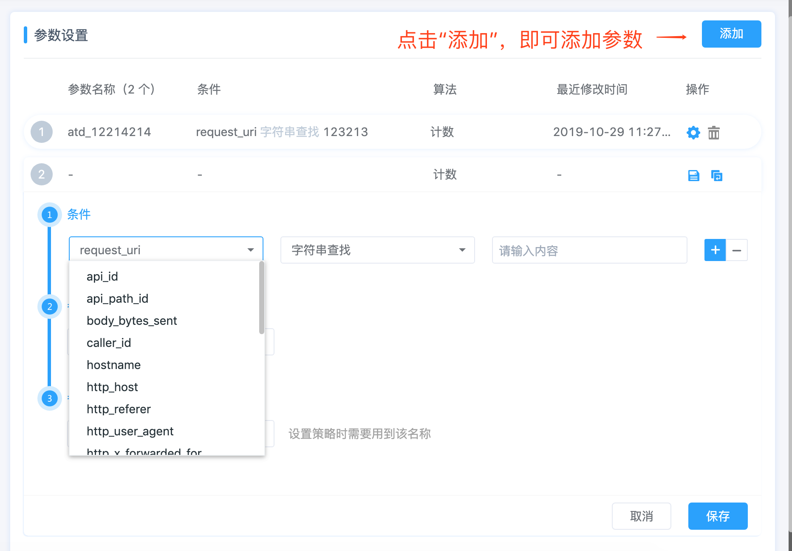
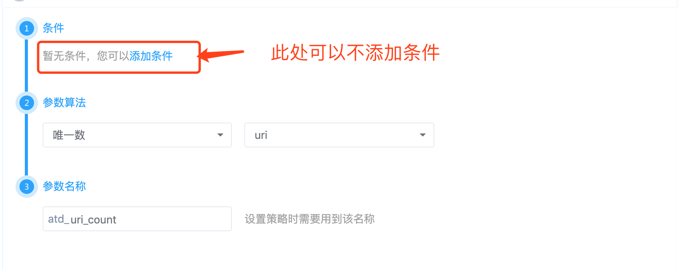
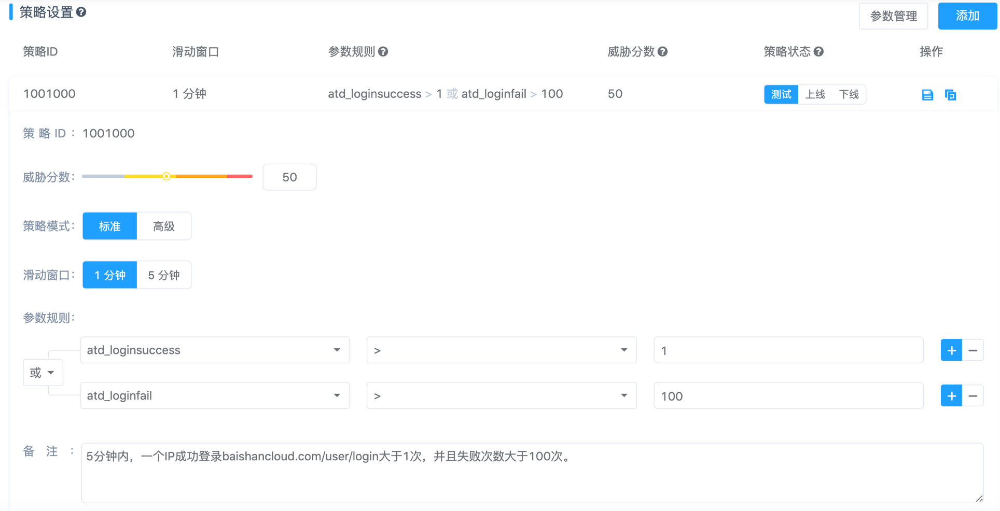
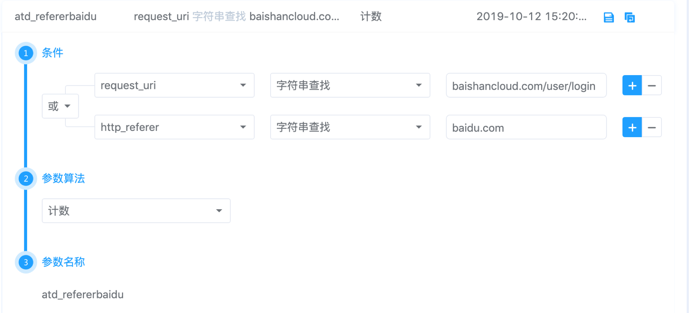
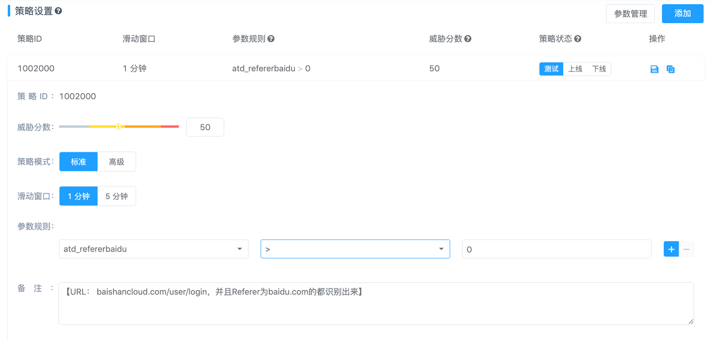

# 1、可编程对抗
ATD支持根据实际业务场景，完全贴合自身业务，通过灵活的参数和策略设置，自定义模型来对抗特定的威胁，丰富和完善安全场景。
#  2、设置可编程对抗模型步骤
##### 第一步、设置模型
##### 第二步、设置参数
##### 第三步、设置策略
## 2.1、设置模型
在可编程对抗模型中，点击“添加”按钮，即可添加模型。根据实际需求，输入对应的【名称】及【描述】。

## 2.2、设置参数
### 2.2.1、什么是参数？
参数表示对日志字段做处理/计算的方式，用于后面的策略设置。
点击“参数管理”，即可进行参数设置。

### 2.2.1、如何添加参数？
点击“添加”按钮，进行添加参数。

添加参数有3个需要设置的内容，包括：条件、参数算法、参数名称。
#### 1、条件
选择需要处理的字段并设置对应的条件。
如果有多组条件，可以点击“+”添加多个条件。

如需切换逻辑关系，可以点击下拉按钮进行切换。

#### 2、参数算法
可以对已设置好的字段进行聚合计算，算法包括：计数、求和、求平均、唯一数。
#### 3、参数名称
在设置策略时，将会用到参数名称，建议设置名称时，表示出该参数的内容，方便后面的应用。
比如：参数为状态码为200的计数时，参数名称可设置为：status_200_count

> 注意：如果不需要设置条件，可以不添加条件。
如：计算uri的唯一数时，可以用如下方式：

## 2.3、设置策略
点击模型中的“设置”，即可进入设置策略页面。
点击“添加”即可开始添加策略。

设置策略主要分7部分：
#### 1、策略ID
是策略的唯一标识，数值约小，优先级越高。
#### 2、威胁分数
用来表示威胁的严重程度，可以根据实际场景进行设置。
#### 3、策略模式
包括：标准和高级两种模式
一般推荐选择“标准模式”
#### 4、滑动窗口
可以选择滑动窗口的长度，当前支持1分钟和5分钟两种滑动窗口。
#### 5、参数规则
可以在参数规则中，选择参数，并设置参数的条件。

条件包括如下6种：

此处可以选择参数，也可以输入数值

#### 6、备注
可在备注中，添加策略的描述，方便以后查看。
#### 7、策略状态
策略状态分3种：
##### 1、上线
ATD会匹配上线状态的策略，如果命中了策略，将会为在威胁事件回溯中展示出命中的事件，并支持查看威胁画像。
##### 2、测试
ATD会匹配测试状态的策略，如果命中了策略，将会为在威胁事件回溯中展示出命中的事件，并支持查看威胁画像。同时该事件会展示“测试”图标，如果开启拦截，将不会拦截该类事件。
##### 3、下线
ATD不再匹配下线状态的策略。
如下图所示，可以根据实际需求，选择策略状态：

# 3、可编程对抗模型案例
## 【案例一】暴力破解成功
>  案例场景详情：5分钟内，一个IP成功登录baishancloud.com/user/login的次数大于1次，并且失败的次数大于100次。
##### 第一步：设置模型
在可编程对抗模型中，点击“添加”按钮，【名称】输入“暴力破解成功”。
##### 第二步：设置参数
设置两个参数：
1、成功登录的次数

2、失败登录的次数

##### 第三步：设置策略

## 【案例二】竞争对手刷接口
> 案例场景详情：访问URL： baishancloud.com/user/login，并且referer不能是baidu.com
##### 第一步：设置模型
在可编程对抗模型中，点击“添加”按钮，【名称】输入“竞争对手刷接口”。
##### 第二步：设置参数

##### 第三步：设置策略

