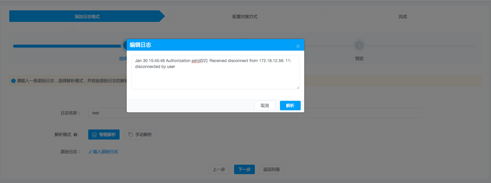
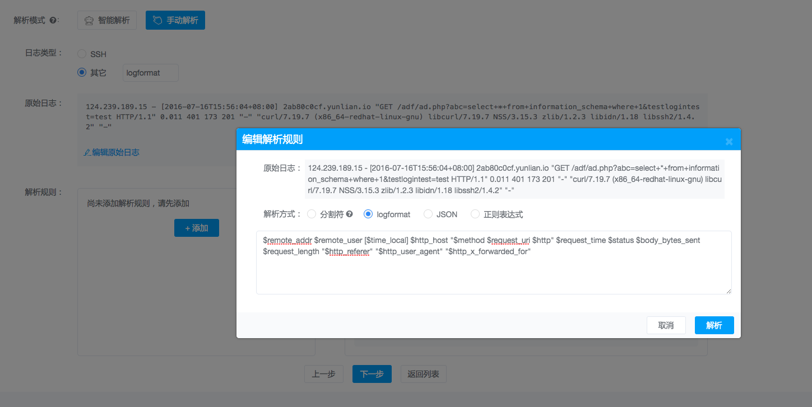
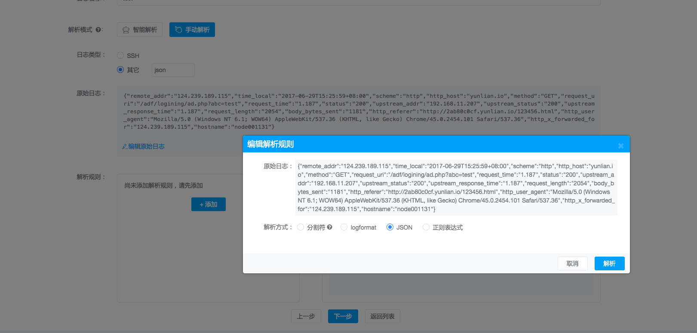
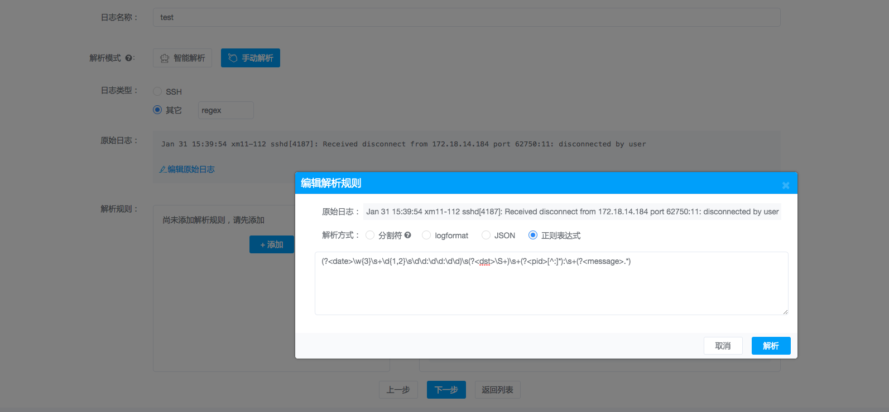
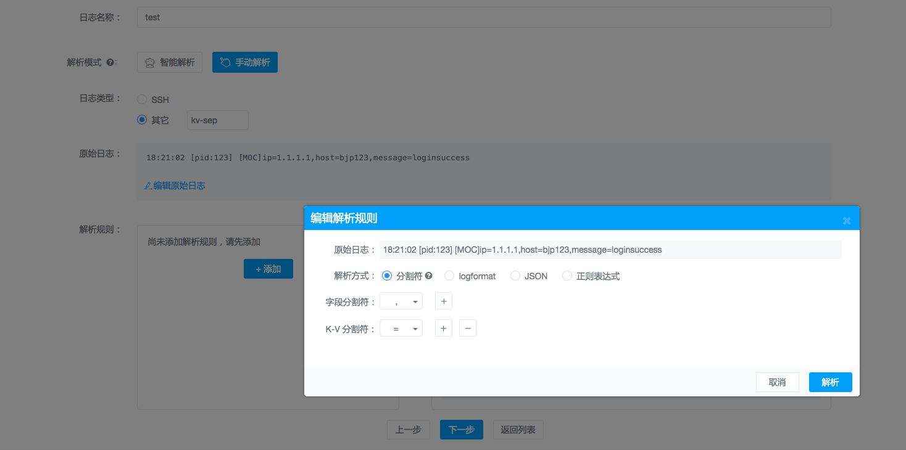

# 日志配置文档
------

## 概述

> 1、在部署完ATD之后，您需要进行日志配置操作，以便ATD可以解析您的日志，进而进行威胁分析。

> 2、ATD支持**智能解析**和**手动解析**两种方式

**智能解析**只需要提供原始日志，ATD系统会自动根据日志格式进行自动化匹配出符合条件的多条结果，根据匹配度自上而下排列，选择最准确的一条结果作为解析方式即可。智能解析适用于系统日志的自动化解析，目前支持的日志类型列表[在此](https://github.com/yunjuhe/atd/blob/master/%E6%99%BA%E8%83%BD%E6%97%A5%E5%BF%97%E8%A7%A3%E6%9E%90.md)

**手动解析**需要提供原始日志，然后根据日志类型选择合适的规则进行递归式解析，直到解析出需要的结果为止。
说明：由于手动解析牵涉较多，下面将重点介绍手动解析方式的流程方式。下图即是两种解析方式，默认是智能解析，只需要把原始日志填入，然后点击解析即可。

> 3、日志对接分为三步：

    （1）日志格式配置，即根据原始日志进行日志类型匹配和字段映射设置，以便ATD可以成功解析您的日志；

    （2）日志对接配置，即配置TopicName、Zookeeper地址等，以便ATD知道从哪里可以获取到您推送的日志；

    （3）推日志，在完成日志配置后，您需要将日志推送到Kafka相应的TopicName中。【注意】请勿将不同格式的域名日志推到同一个TopicName下，否则ATD将无法完成日志解析且不能进行威胁分析。
    



## 步骤一：手动解析日志配置

目前，ATD支持四种日志类型：

1、logformat

2、JSON

3、正则表达式

4、分隔符

请根据您实际的日志类型，添加相应的日志格式，不同日志类型的配置如下：<br/>

### 1、logformat

**（1）日志样例**

```
124.239.189.15 - [2016-07-16T15:56:04+08:00] 2ab80c0cf.yunlian.io "GET /adf/ad.php?abc=select+*+from+information_schema+where+1&testlogintest=test HTTP/1.1" 0.011 401 173 201 "-" "curl/7.19.7 (x86_64-redhat-linux-gnu) libcurl/7.19.7 NSS/3.15.3 zlib/1.2.3 libidn/1.18 libssh2/1.4.2" "-"
```
**（2）log_format字段**

对于纯文本类型的日志，只需要填写一条原始日志及相应的log_format即可，ATD规定的log_format字段名称如下表所示：

|字段名|解释|默认值|
|------|------|-------|
|*remote_addr|客户端IP地址|-|
|*request_uri|请求的uri|-|
|*http_host|请求地址（域名）|必填|
|http_x_forwarded_for|反向客户端IP地址|-|
|time_local|通用日志格式下的本地时间|-|
|status|请求返回的状态码|200|
|hostname|日志来源|-|
|remote_user|客户端用户名称|-|
|method|http请求方法|GET|
|body_bytes_sent|发送给客户端的字节数，不包括响应头的大小|0|
|bytes_sent|发送给客户端的总字节数|-|
|http_referer|记录从哪个页面链接访问过来的|-|
|http_user_agent|记录客户端浏览器相关信息|chrome|
|request_length|请求的长度（包括请求行，请求头和请求正文）|0|
|request_time|请求处理时间，单位为秒，精度毫秒|0|
|upstream_status|upstream返回的状态码信息|-|
|upstream_addr|后端upstream地址，真正提供服务的主机地址|-|
|upstream_response_time|upstream响应时间|0|

**（3）log_format格式要求**

> * 如果您的日志是文本格式，请务必使用ATD指定的字段名称定义log_format，否则ATD将无法完成日志解析；
> * 字段名以\$为前缀，例如：$remote_addr
> * 含有“*”字符的字段必须指定的字段；
> * 如果您的日志中没有http_host，您可以在配置页面上设置http_host的默认值；
> * log_format中的字段必须按顺序与原始日志中的字段一一对应，如果您的日志中包含上述字段之外的字段，可自定义名称，如：field1

**（4）配置示例**

原始日志：

```
124.239.189.15 - [2016-07-16T15:56:04+08:00] 2ab80c0cf.yunlian.io "GET /adf/ad.php?abc=select+*+from+information_schema+where+1&testlogintest=test HTTP/1.1" 0.011 401 173 201 "-" "curl/7.19.7 (x86_64-redhat-linux-gnu) libcurl/7.19.7 NSS/3.15.3 zlib/1.2.3 libidn/1.18 libssh2/1.4.2" "-"
```

log_format：

```
$remote_addr $remote_user [$time_local] $http_host "$method $request_uri $http" $request_time $status $body_bytes_sent $request_length "$http_referer" "$http_user_agent" "$http_x_forwarded_for"
```




### 2、 JSON

**（1）日志样例**

```json
{"remote_addr":"124.239.189.115","time_local":"2017-06-29T15:25:59+08:00","scheme":"http","http_host":"yunlian.io","method":"GET","request_uri":"/adf/logining/ad.php?abc=test","request_time":"1.187","status":"200","upstream_addr":"192.168.11.207","upstream_status":"200","upstream_response_time":"1.187","request_length":"2054","body_bytes_sent":"1181","http_referer":"http://2ab80c0cf.yunlian.io/123456.html","http_user_agent":"Mozilla/5.0 (Windows NT 6.1; WOW64) AppleWebKit/537.36 (KHTML, like Gecko) Chrome/45.0.2454.101 Safari/537.36","http_x_forwarded_for":"124.239.189.115","hostname":"node001131"}
```

**（2）配置示例**

> 如果您的日志如上样例所示，您只需上传一条原始日志，并在界面中设置映射关系即可。

**（3）注意事项**

> 如果是JSON格式数据，请不要格式化数据，也即是原始日志是一行完整的JSON格式数据，而不是多行格式化的数据。




### 3、正则表达式
**（1）日志样例**

```
Jan 31 15:39:54 xm11-112 sshd[4187]: Received disconnect from 172.18.14.184 port 62750:11: disconnected by user
```

**（2）配置示例**

```
(?<date>\w{3}\s+\d{1,2}\s\d\d:\d\d:\d\d)\s(?<dst>\S+)\s+(?<pid>[^:]*):\s+(?<message>.*)
```




### 4、分隔符
**（1）日志样例**

```
18:21:02 [pid:123] [MOC]ip=1.1.1.1,host=bjp123,message=loginsuccess
```

**（2）配置示例**

分隔符解析方式首先进行字段分割，字段分割分为：","、"|"、":"、"&"、";"、"自定义"方式，采用分隔符解析字段分隔符必选。其次根据实际情况是否对字段分隔符解析进行K-V形式解析，K-V形式解析包括："="、":"、"自定义"。无论是分隔符或K-V都可以多段并行解析，也即是可以同时存在多个字段分隔符或K-V分隔符。
针对上述日志样例，字段分隔符采用","，K-V分隔符采用"="，如下图所示：



## 步骤二：日志对接配置
> 在成功完成日志格式配置后，您可以对某个日志格式进行对接配置，选择使用ATD的Kafka或是您私有的Kafka，在选择了您私有的Kafka后，您需要设置TopicName、Zookeeper地址或Kafka地址。


## 步骤三：推日志
> 1、在完成日志配置后，您需要将日志推送到Kafka相应的TopicName中。
【注意】请勿将不同格式的域名日志推到同一个TopicName下，否则ATD将无法完成日志解析且不能进行威胁分析。
2、在进行推日志操作时，您可以根据每个日志格式后对应的文档说明来进行推日志操作。

### 四种推日志方式介绍
ATD支持多种给Kafka推送日志的方式，每种方式有推荐使用场景，以下是几种推送方式优缺点介绍：
#### 1、优先推荐Kafkacat推送方式
##### 优势：
由C语言开发，资源消耗少。

##### 劣势:
（1）推送日志文件的名称固定，有做日志切割的日志文件在切割完成后必须保持文件名不变，如nginx_access.log。
（2）不支持修改日志中的字段，只支持简单的过滤操作。

#### 2、Rsyslog推送方式
##### 优势：
由C语言开发，资源消耗少，支持通配符及新产生文件内容的推送，如/data0/logs/*.log。

##### 劣势：
（1）需要升级rsyslog以及安装rsyslog-kafka插件进行推送，可能需要下载依赖包。
（2）不支持修改日志中的字段，只支持简单的过滤操作

#### 3、Filebeat推送方式

##### 优势： 
由GO语言开发，相比于Java语言开发的logstash资源消耗少一些，可以过滤及简单的修改日志中的字段，支持通配符及新产生文件内容的推送，依赖包较少。

##### 劣势：
（1）相比于C语言开发的工具如rsyslog、kafkacat资源消耗更多一些。
（2）不能精确修改日志中的字段。

#### 4、Logstash推送方式

##### 优势： 
由Java语言开发，可精确修改日志中的字段，支持通配符及新产生文件内容的推送，依赖包较少。

##### 劣势：
资源消耗比另外几种推送工具高。
